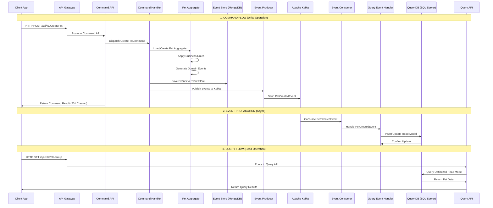

# CQRS Pet Sitter Project

A comprehensive **Command Query Responsibility Segregation (CQRS)** implementation with **Event Sourcing** for a Pet Sitter application. This project demonstrates modern distributed architecture patterns using .NET, Apache Kafka for event streaming, MongoDB for event storage, and SQL Server for read models.

## 🏗️ Architecture Overview

This project implements CQRS pattern with complete separation between:
- **Command Side**: Handles write operations and business logic
- **Query Side**: Handles read operations and optimized data projections  
- **Event Streaming**: Ensures eventual consistency between command and query sides

## 🔄 CQRS Data Flow

```
┌─────────────────┐    ┌──────────────────────┐    ┌─────────────────────┐
│                 │    │                      │    │                     │
│   CLIENT WEB    │    │     API GATEWAY      │    │   COMMAND SIDE      │
│   APPLICATION   │────▶│    (Load Balance)    │────▶│   (Write Model)     │
│                 │    │                      │    │                     │
└─────────────────┘    └──────────────────────┘    └─────────────────────┘
                                 │                            │
                                 │                            │
                                 ▼                            ▼
┌─────────────────────────────────────────┐    ┌─────────────────────────────┐
│                                         │    │                             │
│           QUERY SIDE                    │    │         EVENT STORE         │
│          (Read Model)                   │    │        (MongoDB)           │
│                                         │    │                             │
└─────────────────────────────────────────┘    └─────────────────────────────┘
                    ▲                                         │
                    │                                         │
                    │                                         ▼
                    │                          ┌─────────────────────────────┐
                    │                          │                             │
                    └──────────────────────────│      APACHE KAFKA           │
                                              │   (Event Streaming)         │
                                              │                             │
                                              └─────────────────────────────┘
```

## 📊 Detailed Flow Diagram

### Command to Query Flow



## 🚀 Command Side Flow

### 1. **Command Reception**
- Client sends HTTP request to **Command API** (e.g., `CreatePetController`)
- Controller receives strongly-typed command (e.g., `CreatePetCommand`)
- Command is dispatched via `ICommandDispatcher`

### 2. **Command Processing** 
- **Command Handler** receives command through dispatcher
- Handler loads **Pet Aggregate** from Event Store (if updating existing)
- Business logic is applied within the aggregate root
- Domain events are generated (e.g., `PetCreatedEvent`, `PetUpdatedEvent`)

### 3. **Event Persistence & Publishing**
```csharp
// EventSourcingHandler.SaveAsync()
public async Task SaveAsync(AggregateRoot aggregate)
{
    // 1. Save events to Event Store (MongoDB)
    await _eventStore.SaveEventAsync(
        aggregate.Id,
        aggregate.GetUncommittedChanges(),
        aggregate.Version
    );
    
    // 2. Mark events as committed
    aggregate.MarkAsCommitted();
    
    // 3. Publish events to Kafka (handled by Command Handler)
    foreach (var @event in events)
    {
        await _eventProducer.ProduceAsync(topicName, @event);
    }
}
```

### 4. **Response**
- Command API returns immediate response (usually 201 Created)
- Actual query-side updates happen asynchronously

## 📖 Query Side Flow

### 1. **Event Consumption**
- **Event Consumer** continuously listens to Kafka topics
- Consumes events published by Command side
- Uses reflection to invoke appropriate event handlers

```csharp
// EventConsumer.Consume()
var @event = JsonSerializer.Deserialize<BaseEvent>(message.Value, options);
var handlerMethod = _eventHandler.GetType().GetMethod("On", new Type[] { @event.GetType() });
handlerMethod.Invoke(_eventHandler, new object[] { @event });
```

### 2. **Read Model Updates**
- **Event Handler** processes domain events  
- Updates denormalized read models in SQL Server
- Optimizes data structure for query performance

```csharp
// EventHandler.On()
public async Task On(PetCreatedEvent @event)
{
    PetEntity petEntity = new()
    {
        PetId = @event.Id,
        MemberId = @event.MemberId,
        Name = @event.Name,
        IsActive = @event.IsActive,
    };
    await _petRepository.CreateAsync(petEntity);
}
```

### 3. **Query Processing**
- Client sends HTTP GET request to **Query API**
- `PetLookupController` receives query request
- Query is dispatched to appropriate query handler
- Handler retrieves optimized data from SQL Server read model
- Results returned to client

## 🔄 Data Consistency Model

### **Eventual Consistency**
- **Command Side**: Immediate consistency within aggregate boundaries
- **Cross-Aggregate**: Eventual consistency via domain events
- **Command-to-Query**: Eventual consistency via event streaming
- **Query Side**: Eventually consistent with command side

### **Consistency Timeline**
1. **T0**: Command processed, events saved to Event Store
2. **T1**: Events published to Kafka (milliseconds later)
3. **T2**: Events consumed and read models updated (milliseconds to seconds later)
4. **T3**: Query APIs serve updated data

## 🏢 Project Structure

```
cqrs-petsitter-project/
├── Client/                          # Web UI Application
│   └── PetSitter.Web/              # Blazor Web App
├── Command/                         # Command Side (Write Models)
│   ├── Pet/
│   │   ├── Command.Pet.Api/         # Pet Command API
│   │   ├── Command.Pet.Domain/      # Pet Aggregate & Business Logic  
│   │   └── Command.Pet.Infrastructure/ # Event Store, Handlers
│   └── Sitter/                      # Sitter Command Side
├── Query/                          # Query Side (Read Models)
│   ├── Pet/
│   │   ├── Query.Pet.Api/          # Pet Query API
│   │   ├── Query.Pet.Domain/       # Read Model Entities
│   │   └── Query.Pet.Infrastructure/ # Event Consumers, Repositories
│   └── Sitter/                     # Sitter Query Side  
├── Gateway/                        # API Gateway
│   └── Inbound/Pet/               # Pet Gateway Services
├── Cqrs/                          # Shared CQRS Infrastructure
└── compose.yaml                   # Docker Infrastructure
```

## 🔧 Technology Stack

| Component | Technology | Purpose |
|-----------|------------|---------|
| **Command APIs** | ASP.NET Core Web API | Handle write operations |
| **Query APIs** | ASP.NET Core Web API | Handle read operations |
| **Event Store** | MongoDB | Persist domain events |
| **Read Models** | SQL Server | Optimized query data |
| **Event Streaming** | Apache Kafka | Async event communication |
| **Web Client** | Blazor Server | User interface |
| **API Gateway** | ASP.NET Core | Request routing & load balancing |
| **Infrastructure** | Docker Compose | Local development environment |

## ⚡ Key Benefits

### **Performance**
- **Read/Write Optimization**: Separate models optimized for their specific use cases
- **Scalability**: Independent scaling of command and query sides
- **Caching**: Query side can implement aggressive caching strategies

### **Reliability**  
- **Event Sourcing**: Complete audit trail and ability to reconstruct state
- **Eventual Consistency**: System remains available during network partitions
- **Replay Capability**: Can rebuild read models from event history

### **Maintainability**
- **Separation of Concerns**: Clear boundaries between read and write logic
- **Independent Development**: Teams can work on command/query sides independently  
- **Technology Flexibility**: Different technologies optimized for specific use cases

## 🚀 Getting Started

### 1. **Start Infrastructure**
```bash
docker-compose up -d
```

### 2. **Run Command Side**
```bash
cd Command/Pet/Command.Pet.Api
dotnet run
```

### 3. **Run Query Side**  
```bash
cd Query/Pet/Query.Pet.Api
dotnet run
```

### 4. **Test the Flow**
```bash
# Create a Pet (Command)
curl -X POST http://localhost:5001/api/v1/CreatePet \
  -H "Content-Type: application/json" \
  -d '{"petId":"123e4567-e89b-12d3-a456-426614174000","name":"Fluffy","memberId":"123e4567-e89b-12d3-a456-426614174001"}'

# Query Pets (Query) 
curl http://localhost:5002/api/v1/PetLookup
```

## 📈 Monitoring the Flow

### **Event Store (MongoDB)**
- View stored events: Connect to MongoDB and query the events collection
- Monitor event versioning and aggregate state

### **Kafka Topics**
- Monitor event publication and consumption
- Check for event processing delays or failures

### **Read Models (SQL Server)**
- Verify data consistency between event store and read models
- Monitor query performance and optimization

## 🔍 Troubleshooting

### **Common Issues**
1. **Events not appearing in Query side**: Check Kafka connectivity and consumer group status
2. **Concurrency conflicts**: Monitor aggregate versioning in event store
3. **Performance issues**: Analyze read model queries and consider indexing

### **Health Checks**
- Command APIs: Monitor aggregate loading and event publishing
- Query APIs: Monitor consumer lag and read model freshness
- Infrastructure: Check Kafka, MongoDB, and SQL Server connectivity

This architecture provides a robust foundation for building scalable, maintainable applications that can handle high loads while maintaining data consistency and auditability.